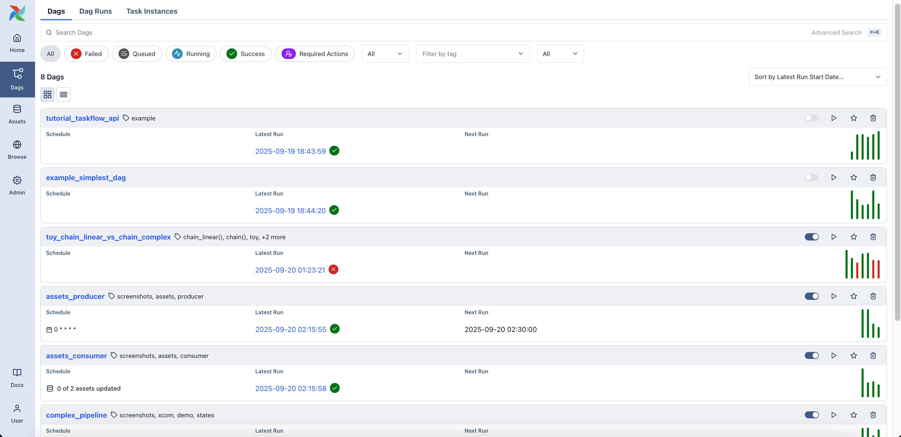
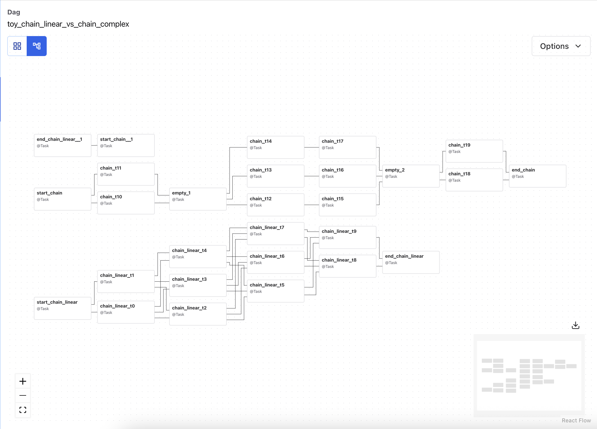
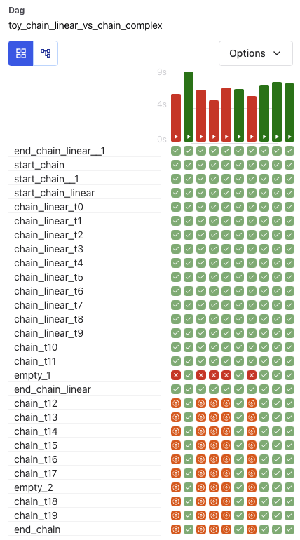

# DAG Geliştirme

## İçindekiler
1. [DAG Anatomisi](#dag-anatomisi)
2. [Hello World DAG](#hello-world-dag)
3. [Task Dependencies](#task-dependencies)
4. [DAG Parametreleri](#dag-parametreleri)
5. [WebUI'dan DAG Görünümü](#webui-dag-gorunumu)
6. [Best Practices](#best-practices)
7. [Referanslar](#referanslar)

---

## DAG Anatomisi

### DAG Bileşenleri

Bir Airflow DAG 4 temel bileşenden oluşur:

```python
from airflow import DAG                    # 1. DAG import
from airflow.operators.bash import BashOperator
from datetime import datetime

# 2. DAG tanımlama
with DAG(
    dag_id='my_dag',
    start_date=datetime(2024, 1, 1),
    schedule_interval='@daily'
) as dag:

    # 3. Task tanımlama
    task1 = BashOperator(
        task_id='task_1',
        bash_command='echo "Hello"'
    )

    task2 = BashOperator(
        task_id='task_2',
        bash_command='echo "World"'
    )

    # 4. Dependency (bağımlılık) tanımlama
    task1 >> task2
```

### DAG Parametreleri

| Parametre | Açıklama | Örnek |
|-----------|----------|-------|
| `dag_id` | Benzersiz DAG ismi (zorunlu) | `'daily_sales_etl'` |
| `start_date` | DAG'in başlangıç tarihi (zorunlu) | `datetime(2024, 1, 1)` |
| `schedule_interval` | Çalışma sıklığı | `'@daily'`, `'0 2 * * *'` |
| `catchup` | Geçmiş run'ları çalıştır | `False` |
| `default_args` | Tüm task'lar için varsayılan argümanlar | `dict` |
| `tags` | DAG etiketleri (filtreleme için) | `['etl', 'sales']` |
| `description` | DAG açıklaması | `'Daily sales ETL'` |
| `max_active_runs` | Aynı anda max çalışan run sayısı | `1` |

---

## Hello World DAG

### Basit Hello World Örneği

Dosya: `dags/01_hello_world_dag.py`

```python
"""
DAG 1: Hello World - İlk Airflow DAG Örneği

Bu DAG Airflow'un en temel yapısını gösterir:
- BashOperator ile komut çalıştırma
- PythonOperator ile Python fonksiyonu çalıştırma
- Basit task dependency
"""

from airflow import DAG
from airflow.operators.bash import BashOperator
from airflow.operators.python import PythonOperator
from datetime import datetime, timedelta

# Default arguments - Tüm task'lar için geçerli
default_args = {
    'owner': 'data-team',
    'depends_on_past': False,
    'email': ['team@example.com'],
    'email_on_failure': False,
    'email_on_retry': False,
    'retries': 1,
    'retry_delay': timedelta(minutes=5),
}

def merhaba_python(**kwargs):
    """Python task fonksiyonu"""
    execution_date = kwargs['execution_date']
    print(f"Merhaba Airflow!")
    print(f"Çalıştırma Tarihi: {execution_date}")
    print(f"DAG ID: {kwargs['dag'].dag_id}")
    print(f"Task ID: {kwargs['task_instance'].task_id}")
    return "Başarılı!"

# DAG tanımı
with DAG(
    dag_id='01_hello_world',
    default_args=default_args,
    description='İlk basit Airflow DAG örneği - Merhaba Dünya',
    schedule_interval='@daily',  # Her gün çalışır
    start_date=datetime(2024, 1, 1),
    catchup=False,  # Geçmiş tarihler için çalıştırma
    tags=['egitim', 'baslangic', 'hello-world'],
) as dag:

    # Task 1: Bash komutu ile tarih yazdır
    task_tarih = BashOperator(
        task_id='tarih_yazdir',
        bash_command='date "+%Y-%m-%d %H:%M:%S" && echo "Airflow çalışıyor!"',
    )

    # Task 2: Python fonksiyonu çalıştır
    task_python = PythonOperator(
        task_id='merhaba_python',
        python_callable=merhaba_python,
        provide_context=True,
    )

    # Task 3: Başka bir Bash komutu
    task_bilgi = BashOperator(
        task_id='sistem_bilgisi',
        bash_command='echo "Hostname: $(hostname)" && echo "User: $(whoami)"',
    )

    # Task 4: Başarı mesajı
    task_basari = BashOperator(
        task_id='basari_mesaji',
        bash_command='echo "DAG başarıyla tamamlandı!"',
    )

    # Task Dependencies (Sıralama)
    task_tarih >> task_python >> task_bilgi >> task_basari
```

### DAG'i Test Etme

```bash
# 1. DAG'i listele
docker exec airflow-webserver-1 airflow dags list | grep hello_world

# 2. DAG'i test et (geçmiş tarih)
docker exec airflow-webserver-1 \
  airflow dags test 01_hello_world 2024-01-01

# 3. Tek bir task'ı test et
docker exec airflow-webserver-1 \
  airflow tasks test 01_hello_world merhaba_python 2024-01-01
```

### Beklenen Çıktı

```
[2024-01-01 10:00:00] {taskinstance.py:123} INFO - Starting task
Merhaba Airflow!
Çalıştırma Tarihi: 2024-01-01 00:00:00
DAG ID: 01_hello_world
Task ID: merhaba_python
[2024-01-01 10:00:01] {taskinstance.py:456} INFO - Task completed
```

---

## Task Dependencies

### Dependency Tanımlama Yöntemleri

#### 1. Bitshift Operatörleri (>>, <<)

```python
# Linear chain
task1 >> task2 >> task3 >> task4

# Aynısı ters yönde
task4 << task3 << task2 << task1

# Paralel fan-out
task1 >> [task2, task3, task4]

# Paralel fan-in
[task2, task3, task4] >> task5
```

#### 2. set_upstream / set_downstream

```python
task2.set_upstream(task1)  # task1 >> task2
task2.set_downstream(task3)  # task2 >> task3

# Çoklu
task5.set_upstream([task2, task3, task4])
```

#### 3. chain() Fonksiyonu

```python
from airflow.models.baseoperator import chain

# Linear chain
chain(task1, task2, task3, task4)

# Complex chain
chain(
    task1,
    [task2, task3],
    task4
)

# Eşdeğer:
# task1 >> [task2, task3] >> task4
```

### Dependency Örnekleri

#### Örnek 1: Linear Pipeline

```python
extract >> transform >> load >> validate
```

**Görsel:**
```
extract → transform → load → validate
```

#### Örnek 2: Paralel İşlem

```python
start >> [process_a, process_b, process_c] >> end
```

**Görsel:**
```
           ┌─ process_a ─┐
start ─────┼─ process_b ─┼──── end
           └─ process_c ─┘
```

#### Örnek 3: Karmaşık Pipeline

```python
from airflow.models.baseoperator import chain

start = DummyOperator(task_id='start')

# Extract tasks
extract_sales = BashOperator(task_id='extract_sales', ...)
extract_customers = BashOperator(task_id='extract_customers', ...)

# Transform tasks
transform_sales = BashOperator(task_id='transform_sales', ...)
transform_customers = BashOperator(task_id='transform_customers', ...)

# Load task
load_data = BashOperator(task_id='load_data', ...)

# Validate task
validate = BashOperator(task_id='validate', ...)

end = DummyOperator(task_id='end')

# Dependencies
start >> [extract_sales, extract_customers]
extract_sales >> transform_sales
extract_customers >> transform_customers
[transform_sales, transform_customers] >> load_data
load_data >> validate >> end
```

**Görsel:**
```
              ┌─ extract_sales ───── transform_sales ─────┐
start ────────┤                                           ├─ load_data ─ validate ─ end
              └─ extract_customers ─ transform_customers ─┘
```

#### Örnek 4: Conditional Dependencies (Branch)

```python
from airflow.operators.python import BranchPythonOperator

def choose_branch(**kwargs):
    """Koşula göre hangi task'ın çalışacağını seç"""
    if kwargs['execution_date'].weekday() < 5:  # Weekday
        return 'weekday_task'
    else:  # Weekend
        return 'weekend_task'

branch = BranchPythonOperator(
    task_id='branch',
    python_callable=choose_branch
)

weekday_task = BashOperator(task_id='weekday_task', ...)
weekend_task = BashOperator(task_id='weekend_task', ...)
end = DummyOperator(task_id='end', trigger_rule='none_failed_min_one_success')

start >> branch >> [weekday_task, weekend_task] >> end
```

---

## DAG Parametreleri

### Schedule Interval

#### Preset Schedules

```python
schedule_interval='@once'       # Bir kez çalış
schedule_interval='@hourly'     # Her saat başı (0 * * * *)
schedule_interval='@daily'      # Her gün gece yarısı (0 0 * * *)
schedule_interval='@weekly'     # Her Pazar gece yarısı (0 0 * * 0)
schedule_interval='@monthly'    # Her ayın 1'i gece yarısı (0 0 1 * *)
schedule_interval='@yearly'     # Her yılın 1 Ocak'ı (0 0 1 1 *)
schedule_interval=None          # Manuel tetikleme
```

#### Cron Expressions

```python
# Her gün saat 02:00'de
schedule_interval='0 2 * * *'

# Her Pazartesi 09:00'da
schedule_interval='0 9 * * 1'

# Her ay 1. ve 15. günü saat 12:00'de
schedule_interval='0 12 1,15 * *'

# Her 4 saatte bir
schedule_interval='0 */4 * * *'

# İş günleri saat 08:00'de (Pzt-Cum)
schedule_interval='0 8 * * 1-5'
```

**Cron Format:**
```
* * * * *
│ │ │ │ │
│ │ │ │ └─── Haftanın günü (0-7, 0 ve 7 Pazar)
│ │ │ └───── Ay (1-12)
│ │ └─────── Ayın günü (1-31)
│ └───────── Saat (0-23)
└─────────── Dakika (0-59)
```

#### Timedelta

```python
from datetime import timedelta

# Her 30 dakikada
schedule_interval=timedelta(minutes=30)

# Her 6 saatte
schedule_interval=timedelta(hours=6)

# Her 2 günde
schedule_interval=timedelta(days=2)
```

### start_date ve catchup

```python
# Geçmiş run'ları çalıştırma (catchup=False)
with DAG(
    dag_id='my_dag',
    start_date=datetime(2024, 1, 1),  # Başlangıç tarihi
    schedule_interval='@daily',
    catchup=False  # Geçmiş tarihler için çalıştırma
) as dag:
    pass

# Geçmiş run'ları çalıştırma (catchup=True)
# start_date ile bugün arasındaki her gün için run oluşturur
with DAG(
    dag_id='backfill_dag',
    start_date=datetime(2024, 1, 1),
    schedule_interval='@daily',
    catchup=True  # 1 Ocak'tan bugüne kadar tüm günler
) as dag:
    pass
```

### Default Arguments

```python
from datetime import timedelta

default_args = {
    'owner': 'data-engineering',  # Task sahibi
    'depends_on_past': False,  # Önceki run'a bağımlı mı?
    'email': ['alerts@company.com'],  # Alert email'leri
    'email_on_failure': True,  # Hata durumunda email
    'email_on_retry': False,  # Retry'da email
    'retries': 3,  # Hata durumunda kaç kez dene
    'retry_delay': timedelta(minutes=5),  # Retry arası bekleme
    'execution_timeout': timedelta(hours=2),  # Maksimum çalışma süresi
    'sla': timedelta(hours=1),  # SLA (Service Level Agreement)
    'on_failure_callback': notify_slack,  # Hata callback
    'on_success_callback': log_success,  # Başarı callback
}

with DAG(
    dag_id='my_dag',
    default_args=default_args,  # Tüm task'lara uygulanır
    start_date=datetime(2024, 1, 1),
) as dag:
    pass
```

### Tags

```python
with DAG(
    dag_id='sales_etl',
    tags=['production', 'etl', 'sales', 'bigquery'],  # Filtreleme için
    ...
) as dag:
    pass
```

**WebUI'da tag ile filtreleme:**
- DAGs sayfasında tag'e tıklayarak filtrele
- Arama: `tag:production`

### Max Active Runs

```python
with DAG(
    dag_id='my_dag',
    max_active_runs=1,  # Aynı anda sadece 1 run çalışabilir
    ...
) as dag:
    pass
```

**Kullanım Senaryosu:**
- Veritabanında locking gerekiyorsa
- Resource constraint varsa
- Sequential execution gerekiyorsa

---

## WebUI'dan DAG Görünümü

### DAG Listesi



**Özellikler:**
- DAG durumu (paused/active)
- Son çalışma zamanı
- Schedule interval
- Tags
- Owner

### Graph View



**Görüntüler:**
- Task dependency grafiği
- Task durumları (success, failed, running, skipped)
- Task grupları

### Grid View



**Görüntüler:**
- Tüm run'ların task durumları
- Zaman çizelgesi
- Task süreleşmeleri

### Gantt View

**Gantt View:** Timeline-based görünüm (Docker ortamınızda DAG çalıştırarak bu görünümü WebUI'da inceleyebilirsiniz)

**Görüntüler:**
- Task başlangıç ve bitiş zamanları
- Paralel çalışma
- Bottleneck'ler

---

## Best Practices

### 1. DAG İsimlendirme

```python
# ✅ DOĞRU
dag_id='daily_sales_etl_pipeline'
dag_id='hourly_log_cleanup'
dag_id='monthly_customer_report'

# ❌ YANLIŞ
dag_id='dag1'
dag_id='test'
dag_id='my_dag'
```

### 2. Start Date

```python
# ✅ DOĞRU - Static start date
from datetime import datetime
start_date=datetime(2024, 1, 1)

# ❌ YANLIŞ - Dynamic start date (her parse'da değişir)
start_date=datetime.now()
start_date=datetime.today()
```

### 3. Catchup

```python
# Yeni DAG'ler için catchup=False
catchup=False  # Geçmiş run'ları çalıştırma

# Backfill gerekiyorsa manuel trigger kullan
# airflow dags backfill -s 2024-01-01 -e 2024-01-31 my_dag
```

### 4. Idempotency (Tekrar Tekrar Çalıştırılabilirlik)

```python
# ✅ DOĞRU - Idempotent
"""
DELETE FROM table WHERE date = '{{ ds }}';
INSERT INTO table SELECT * FROM source WHERE date = '{{ ds }}';
"""

# ❌ YANLIŞ - Non-idempotent
"""
INSERT INTO table SELECT * FROM source WHERE date = '{{ ds }}';
# Tekrar çalıştırılırsa duplicate veri olur
"""
```

### 5. Task İsimlendirme

```python
# ✅ DOĞRU - Açıklayıcı task ID'ler
task_id='extract_sales_data_from_api'
task_id='transform_customer_demographics'
task_id='load_to_bigquery_warehouse'

# ❌ YANLIŞ
task_id='task1'
task_id='t2'
```

### 6. Documentation

```python
# DAG docstring
with DAG(...) as dag:
    pass

dag.doc_md = """
### Sales ETL Pipeline

Bu DAG günlük satış verilerini işler:

1. **Extract**: API'den veri çek
2. **Transform**: Data cleaning ve enrichment
3. **Load**: BigQuery'e yükle
4. **Validate**: Data quality checks

**Schedule**: Her gün 02:00
**Owner**: Data Engineering Team
"""

# Task docstring
extract_task = BashOperator(
    task_id='extract',
    bash_command='...',
    doc_md="""
    ## Extract Task

    Sales API'den son 24 saatin verilerini çeker.

    **Endpoint**: /api/v1/sales
    **Format**: JSON
    """
)
```

### 7. Testing

```python
# DAG test
def test_dag_loaded():
    """DAG'in import edilebilir olduğunu test et"""
    from dags.my_dag import dag
    assert dag is not None
    assert len(dag.tasks) > 0

# Task test
docker exec airflow-webserver-1 \
  airflow tasks test my_dag my_task 2024-01-01
```

---

## Referanslar

### Resmi Dokümantasyon
- [DAG Concepts](https://airflow.apache.org/docs/apache-airflow/stable/core-concepts/dags.html)
- [Task Dependencies](https://airflow.apache.org/docs/apache-airflow/stable/core-concepts/tasks.html#relationships)
- [Schedule Intervals](https://airflow.apache.org/docs/apache-airflow/stable/core-concepts/dag-run.html#cron-presets)

### Best Practices
- [Astronomer - DAG Writing Best Practices](https://docs.astronomer.io/learn/dag-best-practices)
- [Google Cloud - DAG Best Practices](https://cloud.google.com/composer/docs/how-to/using/writing-dags)

### Cron Expressions
- [Crontab Guru](https://crontab.guru/) - Cron expression tester

---

## Cron Expression Detaylı Tablo (30+ Örnek)

| Açıklama | Cron Expression | Çalışma Zamanı |
|----------|----------------|----------------|
| **Basit Zamanlamalar** |||
| Her dakika | `* * * * *` | Her dakika başı |
| Her 5 dakika | `*/5 * * * *` | 00:00, 00:05, 00:10... |
| Her 15 dakika | `*/15 * * * *` | 00:00, 00:15, 00:30, 00:45 |
| Her 30 dakika | `*/30 * * * *` | 00:00, 00:30 |
| Her saat başı | `0 * * * *` | 00:00, 01:00, 02:00... |
| Her 2 saatte | `0 */2 * * *` | 00:00, 02:00, 04:00... |
| Her 4 saatte | `0 */4 * * *` | 00:00, 04:00, 08:00, 12:00, 16:00, 20:00 |
| Her 6 saatte | `0 */6 * * *` | 00:00, 06:00, 12:00, 18:00 |
| **Günlük Zamanlamalar** |||
| Her gün gece yarısı | `0 0 * * *` | 00:00 |
| Her gün sabah 6'da | `0 6 * * *` | 06:00 |
| Her gün saat 9'da | `0 9 * * *` | 09:00 |
| Her gün öğlen | `0 12 * * *` | 12:00 |
| Her gün akşam 6'da | `0 18 * * *` | 18:00 |
| Her gün gece 2'de | `0 2 * * *` | 02:00 (ETL için popüler) |
| Günde 2 kez (sabah/akşam) | `0 9,18 * * *` | 09:00, 18:00 |
| Günde 3 kez | `0 8,12,18 * * *` | 08:00, 12:00, 18:00 |
| **Haftalık Zamanlamalar** |||
| Her Pazartesi | `0 9 * * 1` | Pazartesi 09:00 |
| Her Cuma | `0 9 * * 5` | Cuma 09:00 |
| Her Pazar | `0 0 * * 0` | Pazar 00:00 |
| İş günleri (Pzt-Cum) | `0 8 * * 1-5` | Pazartesi-Cuma 08:00 |
| Hafta sonları | `0 10 * * 0,6` | Cumartesi, Pazar 10:00 |
| Her Pazartesi ve Çarşamba | `0 9 * * 1,3` | Pazartesi, Çarşamba 09:00 |
| **Aylık Zamanlamalar** |||
| Her ayın 1'i | `0 0 1 * *` | Her ay 1. gün 00:00 |
| Her ayın 15'i | `0 0 15 * *` | Her ay 15. gün 00:00 |
| Her ayın son günü | `0 0 L * *` | ⚠️ Not supported, use `@monthly` + logic |
| Ayın 1'i ve 15'i | `0 0 1,15 * *` | Her ay 1 ve 15. gün |
| Her ayın ilk Pazartesi | `0 9 * * 1#1` | ⚠️ Not in standard cron |
| **Çeyreksel/Yıllık** |||
| Çeyrek başı (Ocak, Nisan...) | `0 0 1 1,4,7,10 *` | Q1, Q2, Q3, Q4 başlangıcı |
| Yıl başı (1 Ocak) | `0 0 1 1 *` | 1 Ocak 00:00 |
| **Kompleks Pattern'ler** |||
| İş günleri sabah 8-18 arası | `0 8-18 * * 1-5` | Pzt-Cum 08:00-18:00 arası |
| Her 10 dakika, sadece iş saatleri | `*/10 9-17 * * 1-5` | İş günleri 09:00-17:00 arası |
| Gece yarısı hariç her saat | `0 1-23 * * *` | 01:00-23:00 arası her saat |

> **💡 İpucu:** Cron expression test etmek için [crontab.guru](https://crontab.guru/) kullanın.

> **⚠️ Uyarı:** Airflow scheduler dakika granularity ile çalışır. Saniye desteği yoktur.

---

## DAG Parametreleri Detaylı Tablo (20+ Parametre)

| Parametre | Tip | Default | Açıklama | Örnek |
|-----------|-----|---------|----------|-------|
| **Temel Parametreler** |||||
| `dag_id` | str | - | Benzersiz DAG kimliği (ZORUNLU) | `'daily_sales_etl'` |
| `description` | str | None | DAG açıklaması | `'Günlük satış verisi ETL'` |
| `schedule_interval` | str/timedelta | None | Çalışma sıklığı | `'@daily'`, `'0 2 * * *'` |
| `start_date` | datetime | - | Başlangıç tarihi (ZORUNLU) | `datetime(2024, 1, 1)` |
| `end_date` | datetime | None | Bitiş tarihi (optional) | `datetime(2024, 12, 31)` |
| **Execution Parametreleri** |||||
| `catchup` | bool | True | Geçmiş run'ları çalıştır | `False` (önerilen) |
| `max_active_runs` | int | 16 | Aynı anda max run sayısı | `1` (sequential için) |
| `max_active_tasks` | int | 16 | Aynı anda max task sayısı | `32` |
| `dagrun_timeout` | timedelta | None | DAG run max süresi | `timedelta(hours=2)` |
| `concurrency` | int | 16 | Deprecated, use max_active_tasks | - |
| **Default Args** |||||
| `default_args` | dict | {} | Tüm task'lara default argümanlar | `{'retries': 3, 'owner': 'data-team'}` |
| `params` | dict | {} | DAG parametreleri (UI'dan override edilebilir) | `{'env': 'prod', 'batch_size': 1000}` |
| **UI ve Documentation** |||||
| `tags` | list[str] | [] | DAG etiketleri (filtreleme) | `['etl', 'production', 'sales']` |
| `doc_md` | str | None | Markdown dokümantasyonu | `"""# ETL Pipeline\n..."""` |
| `orientation` | str | 'LR' | Graph view yönlendirme | `'LR'` (left-right), `'TB'` (top-bottom) |
| **Scheduling Davranışı** |||||
| `is_paused_upon_creation` | bool | True | Başlangıçta duraklatıl mı? | `False` (prod'da auto-start) |
| `render_template_as_native_obj` | bool | False | Jinja template'leri Python native object'e çevir | `True` |
| **Access Control** |||||
| `access_control` | dict | None | RBAC permissions | `{'Admin': {'can_read', 'can_edit'}}` |
| `owner_links` | dict | None | Owner bilgisi linkleri | `{'data-team': 'https://wiki/data-team'}` |
| **Advanced** |||||
| `default_view` | str | 'grid' | Default UI view | `'graph'`, `'tree'`, `'grid'` |
| `template_searchpath` | list[str] | None | Jinja template arama path'i | `['/opt/airflow/templates']` |
| `user_defined_macros` | dict | None | Custom Jinja macros | `{'my_func': lambda x: x*2}` |
| `user_defined_filters` | dict | None | Custom Jinja filters | `{'my_filter': lambda x: x.upper()}` |
| `sla_miss_callback` | callable | None | SLA kaçırılırsa callback | `send_alert_to_slack` |
| `on_success_callback` | callable | None | DAG başarılı olunca callback | `notify_success` |
| `on_failure_callback` | callable | None | DAG fail olunca callback | `notify_failure` |

**Örnek Kullanım:**

```python
from datetime import datetime, timedelta

default_args = {
    'owner': 'data-engineering',
    'depends_on_past': False,
    'email': ['alerts@company.com'],
    'email_on_failure': True,
    'email_on_retry': False,
    'retries': 3,
    'retry_delay': timedelta(minutes=5),
    'execution_timeout': timedelta(hours=2),
}

with DAG(
    dag_id='complex_dag_example',
    description='Production ETL pipeline with all features',
    schedule_interval='0 2 * * *',  # Daily 02:00
    start_date=datetime(2024, 1, 1),
    end_date=None,  # Runs indefinitely
    catchup=False,
    max_active_runs=2,
    max_active_tasks=32,
    dagrun_timeout=timedelta(hours=3),
    default_args=default_args,
    params={'env': 'production', 'batch_size': 10000},
    tags=['production', 'etl', 'sales', 'bigquery'],
    orientation='LR',
    is_paused_upon_creation=False,
    render_template_as_native_obj=True,
    doc_md="""
    # Sales ETL Pipeline

    Daily ETL pipeline for sales data processing.

    ## Stages
    1. Extract from API
    2. Transform and enrich
    3. Load to BigQuery
    4. Data quality checks
    """
) as dag:
    pass
```

---

## Common DAG Patterns

### Pattern 1: Batch Processing

**Use Case:** Günlük batch işlem (örn: log analizi, data aggregation)

```python
from airflow import DAG
from airflow.operators.bash import BashOperator
from airflow.operators.python import PythonOperator
from datetime import datetime, timedelta

with DAG(
    'batch_processing_pattern',
    schedule_interval='@daily',
    start_date=datetime(2024, 1, 1),
    catchup=False
) as dag:

    # Önceki gün verisini işle
    extract = BashOperator(
        task_id='extract',
        bash_command='python scripts/extract_logs.py --date {{ yesterday_ds }}'
    )

    transform = PythonOperator(
        task_id='transform',
        python_callable=lambda **kwargs: print(f"Processing {kwargs['ds']}")
    )

    load = BashOperator(
        task_id='load',
        bash_command='python scripts/load_to_warehouse.py --date {{ ds }}'
    )

    extract >> transform >> load
```

### Pattern 2: Incremental Loading

**Use Case:** Sadece yeni/değişen veriyi yükle

```python
@dag(
    dag_id='incremental_loading_pattern',
    schedule_interval='@hourly',
    start_date=datetime(2024, 1, 1),
    catchup=False
)
def incremental_etl():

    @task
    def get_last_watermark():
        """Son işlenen timestamp'i al"""
        # SELECT MAX(updated_at) FROM target_table
        return '2024-01-01 10:00:00'

    @task
    def extract_incremental(watermark: str):
        """Watermark'tan sonraki veriyi çek"""
        query = f"SELECT * FROM source WHERE updated_at > '{watermark}'"
        # return data
        return []

    @task
    def upsert_data(data: list):
        """MERGE/UPSERT yap"""
        # INSERT ... ON CONFLICT UPDATE
        pass

    watermark = get_last_watermark()
    data = extract_incremental(watermark)
    upsert_data(data)

dag = incremental_etl()
```

### Pattern 3: Change Data Capture (CDC)

**Use Case:** Database değişikliklerini yakalama

```python
with DAG('cdc_pattern', schedule_interval='*/5 * * * *', ...) as dag:

    detect_changes = PythonOperator(
        task_id='detect_changes',
        python_callable=lambda: [
            {'op': 'INSERT', 'id': 1, 'data': {...}},
            {'op': 'UPDATE', 'id': 2, 'data': {...}},
            {'op': 'DELETE', 'id': 3},
        ]
    )

    process_inserts = PythonOperator(...)
    process_updates = PythonOperator(...)
    process_deletes = PythonOperator(...)

    detect_changes >> [process_inserts, process_updates, process_deletes]
```

### Pattern 4: Data Quality Pipeline

**Use Case:** Data quality checks ve alerts

```python
from airflow.providers.google.cloud.operators.bigquery import BigQueryCheckOperator

with DAG('data_quality_pattern', ...) as dag:

    # Row count check
    check_row_count = BigQueryCheckOperator(
        task_id='check_row_count',
        sql='SELECT COUNT(*) > 1000 FROM table WHERE date = "{{ ds }}"',
        use_legacy_sql=False
    )

    # Null check
    check_nulls = BigQueryCheckOperator(
        task_id='check_nulls',
        sql='SELECT COUNTIF(customer_id IS NULL) = 0 FROM table'
    )

    # Duplicate check
    check_duplicates = BigQueryCheckOperator(
        task_id='check_duplicates',
        sql='''
            SELECT COUNT(*) = COUNT(DISTINCT order_id)
            FROM table
            WHERE date = "{{ ds }}"
        '''
    )

    # Schema check
    @task
    def validate_schema():
        expected_columns = ['order_id', 'customer_id', 'amount']
        # Check if columns exist
        pass

    [check_row_count, check_nulls, check_duplicates] >> validate_schema()
```

### Pattern 5: Fan-Out Fan-In

**Use Case:** Paralel işlem sonrası birleştirme

```python
@dag(dag_id='fan_out_fan_in', ...)
def parallel_processing():

    @task
    def split_data():
        """Veriyi chunk'lara böl"""
        return [
            {'chunk_id': 1, 'data': [...]},
            {'chunk_id': 2, 'data': [...]},
            {'chunk_id': 3, 'data': [...]},
        ]

    @task
    def process_chunk(chunk: dict):
        """Her chunk'ı işle"""
        chunk_id = chunk['chunk_id']
        data = chunk['data']
        # Process...
        return {'chunk_id': chunk_id, 'result': 'processed'}

    @task
    def combine_results(results: list):
        """Sonuçları birleştir"""
        total = sum(r['chunk_id'] for r in results)
        print(f"Processed {len(results)} chunks, total: {total}")

    chunks = split_data()
    # Fan-out: Her chunk için ayrı task
    processed = [process_chunk(chunk) for chunk in chunks]
    # Fan-in: Tüm sonuçları birleştir
    combine_results(processed)

dag = parallel_processing()
```

### Pattern 6: Dynamic Task Mapping (Airflow 2.3+)

**Use Case:** Runtime'da task sayısı belirlenir

```python
from airflow.decorators import task

@dag(dag_id='dynamic_task_mapping', ...)
def dynamic_tasks():

    @task
    def get_files_to_process():
        """GCS'deki dosyaları listele"""
        return [
            'gs://bucket/file1.csv',
            'gs://bucket/file2.csv',
            'gs://bucket/file3.csv',
        ]

    @task
    def process_file(file_path: str):
        """Her dosyayı işle"""
        print(f"Processing {file_path}")
        return f"Processed: {file_path}"

    files = get_files_to_process()
    # Dinamik olarak her dosya için task oluştur
    process_file.expand(file_path=files)

dag = dynamic_tasks()
```

---

## Anti-Patterns (Yapılmaması Gerekenler)

### ❌ Anti-Pattern 1: Top-Level Code

**Kötü:**
```python
import requests

# ❌ Her DAG parse'ında çalışır!
api_response = requests.get('https://api.example.com/data')
data = api_response.json()

with DAG(...) as dag:
    process_data = PythonOperator(
        task_id='process',
        python_callable=lambda: print(data)
    )
```

**İyi:**
```python
# ✅ Sadece task çalışınca execute olur
@task
def fetch_and_process():
    api_response = requests.get('https://api.example.com/data')
    data = api_response.json()
    # process data
    return data
```

### ❌ Anti-Pattern 2: Dynamic DAG Generation Pitfalls

**Kötü:**
```python
# ❌ Her müşteri için ayrı DAG (100+ DAG oluşur!)
for customer_id in range(1, 101):
    with DAG(f'process_customer_{customer_id}', ...) as dag:
        task = PythonOperator(...)
```

**İyi:**
```python
# ✅ Tek DAG, dynamic task mapping
@dag(...)
def process_all_customers():
    @task
    def get_customers():
        return list(range(1, 101))

    @task
    def process_customer(customer_id: int):
        # process
        pass

    customers = get_customers()
    process_customer.expand(customer_id=customers)
```

### ❌ Anti-Pattern 3: Hard-Coded Values

**Kötü:**
```python
# ❌ Environment'a göre değişmez
PROJECT_ID = 'my-prod-project'
DATASET = 'production_dataset'
```

**İyi:**
```python
# ✅ Environment variable kullan
import os
PROJECT_ID = os.getenv('GCP_PROJECT_ID', 'my-dev-project')
DATASET = os.getenv('BQ_DATASET', 'dev_dataset')
```

### ❌ Anti-Pattern 4: Excessive Task Dependencies

**Kötü:**
```python
# ❌ Gereksiz sequential dependency
task1 >> task2 >> task3 >> task4 >> task5
# (task2 ve task3 paralel çalışabilir)
```

**İyi:**
```python
# ✅ Gerçek dependency'lere göre
task1 >> [task2, task3] >> task4 >> task5
```

### ❌ Anti-Pattern 5: Large XCom Data

**Kötü:**
```python
# ❌ XCom'da büyük veri (10MB+ DataFrame)
@task
def extract():
    df = pd.read_csv('large_file.csv')  # 10GB
    return df  # XCom'a gider, database'i şişirir!
```

**İyi:**
```python
# ✅ Veriyi GCS/S3'e kaydet, sadece path döndür
@task
def extract():
    df = pd.read_csv('large_file.csv')
    path = 'gs://bucket/temp/data.parquet'
    df.to_parquet(path)
    return path  # Sadece path XCom'a gider

@task
def transform(path: str):
    df = pd.read_parquet(path)
    # process...
```

---

## Template Variables (Jinja2) Detaylı

### Yaygın Template Variables

| Variable | Açıklama | Örnek Değer |
|----------|----------|-------------|
| `{{ ds }}` | Execution date (YYYY-MM-DD) | `2024-01-15` |
| `{{ ds_nodash }}` | Execution date (YYYYMMDD) | `20240115` |
| `{{ yesterday_ds }}` | Dün (YYYY-MM-DD) | `2024-01-14` |
| `{{ tomorrow_ds }}` | Yarın (YYYY-MM-DD) | `2024-01-16` |
| `{{ execution_date }}` | Execution datetime | `2024-01-15 00:00:00` |
| `{{ next_execution_date }}` | Sonraki execution | `2024-01-16 00:00:00` |
| `{{ prev_execution_date }}` | Önceki execution | `2024-01-14 00:00:00` |
| `{{ dag }}` | DAG objesi | `<DAG: my_dag>` |
| `{{ task }}` | Task objesi | `<Task: my_task>` |
| `{{ task_instance }}` (or `{{ ti }}`) | Task instance | `<TaskInstance: my_dag.my_task 2024-01-15>` |
| `{{ params }}` | DAG params | `{'env': 'prod'}` |
| `{{ var.value.my_var }}` | Airflow Variable | `'my_value'` |
| `{{ conn.my_conn.host }}` | Connection info | `'mydb.example.com'` |

**Örnek Kullanımlar:**

```python
# Bash command
BashOperator(
    task_id='process',
    bash_command='python script.py --date {{ ds }} --env {{ params.env }}'
)

# SQL query
BigQueryInsertJobOperator(
    task_id='load',
    configuration={
        "query": {
            "query": """
                SELECT * FROM source
                WHERE date BETWEEN '{{ yesterday_ds }}' AND '{{ ds }}'
            """
        }
    }
)

# File path
GCSObjectExistenceSensor(
    task_id='check_file',
    bucket='my-bucket',
    object='data/sales_{{ ds_nodash }}.csv'  # sales_20240115.csv
)

# Custom macro
@task(templates_dict={'date': '{{ ds }}'}, provide_context=True)
def my_task(templates_dict, **kwargs):
    date = templates_dict['date']
    print(f"Processing date: {date}")
```

---

## Pratik Alıştırmalar

### Alıştırma 1: Cron Expression Yazma

**Görev:** Aşağıdaki senaryolar için cron expression yazın:

1. Her Pazartesi sabah 8'de
2. İş günleri her 2 saatte bir
3. Ayın 1'i ve 15'i gece yarısı
4. Her 10 dakika, sadece 09:00-17:00 arası

**Cevaplar:**
```python
# 1
schedule_interval='0 8 * * 1'

# 2
schedule_interval='0 */2 * * 1-5'

# 3
schedule_interval='0 0 1,15 * *'

# 4
schedule_interval='*/10 9-17 * * *'
```

### Alıştırma 2: DAG Parametreleri

**Görev:** Production-ready bir DAG oluşturun (tüm best practices ile):

```python
from datetime import datetime, timedelta

default_args = {
    'owner': 'data-team',
    'retries': 3,
    'retry_delay': timedelta(minutes=5),
    'email': ['alerts@company.com'],
    'email_on_failure': True,
}

with DAG(
    dag_id='production_ready_dag',
    description='Production ETL pipeline example',
    schedule_interval='0 2 * * *',
    start_date=datetime(2024, 1, 1),
    catchup=False,
    max_active_runs=1,
    default_args=default_args,
    tags=['production', 'etl'],
    dagrun_timeout=timedelta(hours=2)
) as dag:
    # Tasks...
    pass
```

### Alıştırma 3: Template Variables

**Görev:** Incremental loading için template variables kullanın:

```python
from airflow.providers.google.cloud.operators.bigquery import BigQueryInsertJobOperator

load_incremental = BigQueryInsertJobOperator(
    task_id='load_incremental',
    configuration={
        "query": {
            "query": f"""
                INSERT INTO `project.dataset.target`
                SELECT *
                FROM `project.dataset.source`
                WHERE DATE(created_at) = '{{{{ ds }}}}'
                AND created_at >= '{{{{ yesterday_ds }}}} 00:00:00'
                AND created_at < '{{{{ ds }}}} 00:00:00'
            """,
            "useLegacySql": False
        }
    }
)
```

### Alıştırma 4: Dynamic Task Mapping

**Görev:** Dosya listesine göre dinamik task oluşturun:

```python
@dag(dag_id='dynamic_file_processing', ...)
def process_files():

    @task
    def list_files():
        """GCS'deki dosyaları listele"""
        from google.cloud import storage
        client = storage.Client()
        bucket = client.bucket('my-bucket')
        blobs = bucket.list_blobs(prefix='raw/')
        return [blob.name for blob in blobs]

    @task
    def process_file(file_path: str):
        """Dosyayı işle"""
        print(f"Processing {file_path}")
        # GCS -> BigQuery
        return f"Processed: {file_path}"

    @task
    def report_results(results: list):
        """Sonuçları raporla"""
        print(f"Processed {len(results)} files")

    files = list_files()
    processed = process_file.expand(file_path=files)
    report_results(processed)

dag = process_files()
```

### Alıştırma 5: Data Quality Checks

**Görev:** Comprehensive data quality pipeline oluşturun:

```python
with DAG('data_quality_checks', ...) as dag:

    check_row_count = BigQueryCheckOperator(
        task_id='check_row_count',
        sql='SELECT COUNT(*) > 1000 FROM table WHERE date = "{{ ds }}"'
    )

    check_nulls = BigQueryCheckOperator(
        task_id='check_nulls',
        sql='SELECT COUNTIF(id IS NULL) = 0 FROM table'
    )

    check_duplicates = BigQueryCheckOperator(
        task_id='check_duplicates',
        sql='SELECT COUNT(*) = COUNT(DISTINCT id) FROM table WHERE date = "{{ ds }}"'
    )

    @task
    def check_freshness():
        """Veri güncelliği kontrol et"""
        # SELECT MAX(updated_at) FROM table
        # Assert < 24 hours old
        pass

    @task
    def check_schema():
        """Schema değişikliklerini kontrol et"""
        expected_columns = ['id', 'name', 'created_at']
        # Assert all columns exist
        pass

    [check_row_count, check_nulls, check_duplicates] >> check_freshness() >> check_schema()
```

---

## Sık Sorulan Sorular (FAQ)

**S1: start_date geçmişte olmalı mı, yoksa gelecekte mi?**

A: **Geçmişte** olmalı. Airflow execution_date geçmişe bakar. `start_date=datetime(2024, 1, 1)` ve bugün 2024-01-15 ise, `catchup=True` olmadıkça sadece bir sonraki scheduled time'da çalışır.

**S2: schedule_interval=None nedir?**

A: Manuel tetikleme. DAG sadece UI'dan veya API ile trigger edilebilir, otomatik çalışmaz.

**S3: catchup=True ne zaman kullanılır?**

A: Geçmiş verileri backfill etmek için. Örnek: `start_date=2024-01-01`, bugün 2024-01-15, `schedule_interval='@daily'` ise, 14 gün için run oluşturur. **Dikkatli kullanın!**

**S4: {{ ds }} ve {{ execution_date }} farkı?**

A:
- `{{ ds }}`: String format (YYYY-MM-DD), örn `'2024-01-15'`
- `{{ execution_date }}`: Datetime object, örn `datetime(2024, 1, 15, 0, 0, 0)`

**S5: Jinja template nerede kullanılabilir?**

A: Sadece template fields'larda:
- `bash_command` (BashOperator)
- `sql` (SQLOperators)
- `bucket`, `object` (GCS operators)
- Operator'ün `template_fields` attribute'unda listelenmiş fieldlar

**S6: Dynamic DAG generation yapmalı mıyım?**

A: **Hayır**, çoğu durumda dynamic task mapping daha iyi. Dynamic DAG generation scheduler'ı yavaşlatır.

**S7: DAG'leri programatically pause edebilir miyim?**

A:
```python
from airflow.models import DagModel

DagModel.get_dagmodel('my_dag').set_is_paused(is_paused=True)
```

**S8: DAG run'ı manuel trigger ederken parametre geçebilir miyim?**

A: Evet, conf ile:
```bash
airflow dags trigger my_dag --conf '{"key": "value"}'
```
DAG'de:
```python
conf = kwargs['dag_run'].conf
param_value = conf.get('key')
```

**S9: Task dependency döngüsü (cycle) olursa ne olur?**

A: Airflow hata verir: `airflow.exceptions.AirflowDagCycleException`. Graph acyclic (DAG) olmalı.

**S10: Bir DAG'i başka DAG'e depend edebilir miyim?**

A: Evet, ExternalTaskSensor ile:
```python
wait_for_upstream = ExternalTaskSensor(
    task_id='wait_for_upstream',
    external_dag_id='upstream_dag',
    external_task_id='final_task'
)
```

**S11: max_active_runs=1 ne işe yarar?**

A: Sequential execution zorlar. Önceki run tamamlanmadan yeni run başlamaz. Database lock gerekiyorsa kullanışlı.

**S12: DAG'i programatically trigger edebilir miyim?**

A: Evet:
```python
from airflow.api.common.trigger_dag import trigger_dag

trigger_dag(
    dag_id='my_dag',
    run_id='manual_run_' + datetime.now().isoformat(),
    conf={'key': 'value'}
)
```

---

## Sonraki Adımlar

- **[04-operatorler.md](04-operatorler.md)**: Operator'ler ve kullanımları
- **[05-webui-yonetim.md](05-webui-yonetim.md)**: WebUI detaylı kullanım
