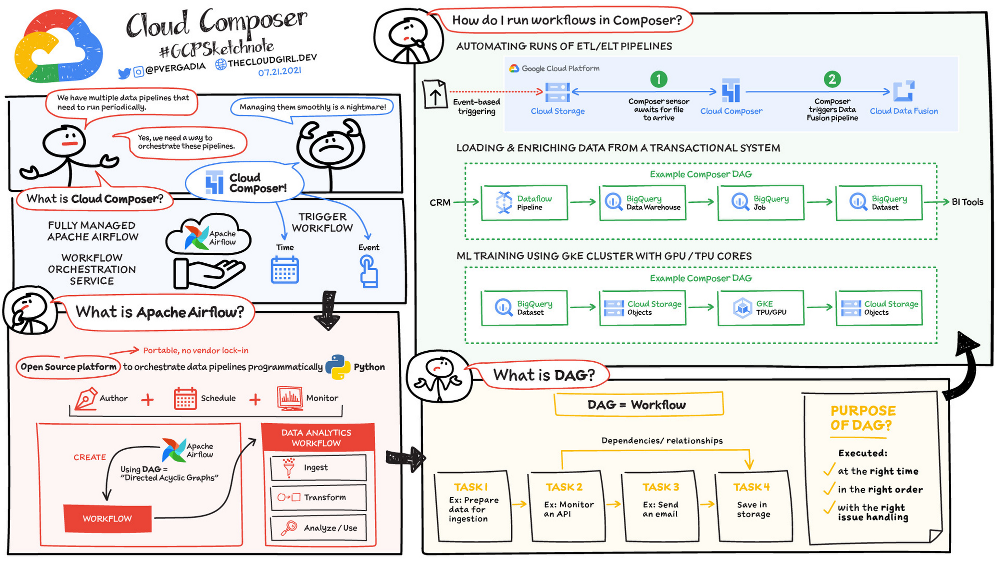

# GCP Cloud Composer (Airflow) / BigQuery Entegrasyonu

## İçindekiler

1. [BigQuery Operators](#bigquery-operators)
2. [Connection Kurulumu](#connection-kurulumu)
3. [BigQueryInsertJobOperator](#bigqueryinsertjoboperator)
4. [Transfer Operators](#transfer-operators)
5. [Data Quality Checks](#data-quality-checks)
6. [Best Practices](#best-practices)
7. [Referanslar](#referanslar)

---

## Cloud Composer



## BigQuery Operators

### Provider Package Kurulumu

```bash
# Docker Compose'da
_PIP_ADDITIONAL_REQUIREMENTS: apache-airflow-providers-google==10.13.1

# Manuel kurulum
pip install apache-airflow-providers-google
```

### Temel BigQuery Operators

| Operator                       | Kullanım            | Örnek                 |
| ------------------------------ | -------------------- | ---------------------- |
| `BigQueryInsertJobOperator`  | Query çalıştırma | SELECT, CREATE, INSERT |
| `GCSToBigQueryOperator`      | GCS → BigQuery      | CSV/JSON load          |
| `BigQueryToGCSOperator`      | BigQuery → GCS      | Export data            |
| `BigQueryCheckOperator`      | Data quality check   | Row count > 0          |
| `BigQueryValueCheckOperator` | Value validation     | SUM(amount) > 1000     |
| `BigQueryGetDataOperator`    | Python'a veri çekme | Data fetch             |

---

## Connection Kurulumu

### Service Account Oluşturma

**GCP Console:**

1. IAM & Admin → Service Accounts
2. Create Service Account
3. Roller:
   - BigQuery Admin
   - BigQuery Data Editor
   - Storage Admin (GCS için)
4. JSON key oluştur ve indir

### Airflow Connection Ekleme

**WebUI:**

1. Admin → Connections
2. Add Connection:
   - **Connection Id**: `google_cloud_default`
   - **Connection Type**: Google Cloud
   - **Keyfile Path**: `/opt/airflow/config/gcp-keyfile.json`
   - (veya) **Keyfile JSON**: JSON içeriğini yapıştır

**Docker Compose'da Mount:**

```yaml
volumes:
  - ./config/gcp-keyfile.json:/opt/airflow/config/gcp-keyfile.json:ro
```

**Environment Variable ile:**

```bash
GOOGLE_APPLICATION_CREDENTIALS=/opt/airflow/config/gcp-keyfile.json
```

---

## BigQueryInsertJobOperator

En esnek BigQuery operator'ü. Her türlü BigQuery job'ını çalıştırabilir.

### Basit Query

Dosya: `dags/06_bigquery_basic_dag.py`

```python
from airflow.providers.google.cloud.operators.bigquery import BigQueryInsertJobOperator

create_table = BigQueryInsertJobOperator(
    task_id='create_sample_table',
    configuration={
        "query": {
            "query": f"""
                CREATE TABLE IF NOT EXISTS `{PROJECT_ID}.{DATASET}.sample_sales` (
                    order_id STRING,
                    customer_id STRING,
                    product_name STRING,
                    quantity INT64,
                    unit_price FLOAT64,
                    total_amount FLOAT64,
                    order_date DATE,
                    created_at TIMESTAMP
                )
                PARTITION BY order_date
                OPTIONS(
                    description="Örnek satış verisi tablosu",
                    labels=[("env", "development")]
                )
            """,
            "useLegacySql": False
        }
    },
    location='US'
)
```

### INSERT Query

```python
insert_data = BigQueryInsertJobOperator(
    task_id='insert_sample_data',
    configuration={
        "query": {
            "query": f"""
                INSERT INTO `{PROJECT_ID}.{DATASET}.sample_sales`
                VALUES
                    ('ORD001', 'CUST001', 'Laptop', 2, 3500.00, 7000.00, '2024-01-15', CURRENT_TIMESTAMP()),
                    ('ORD002', 'CUST002', 'Phone', 1, 2500.00, 2500.00, '2024-01-16', CURRENT_TIMESTAMP())
            """,
            "useLegacySql": False
        }
    },
    location='US'
)
```

### SELECT ve Destination Table

```python
query_and_save = BigQueryInsertJobOperator(
    task_id='query_sales_summary',
    configuration={
        "query": {
            "query": f"""
                SELECT
                    order_date,
                    COUNT(*) as order_count,
                    SUM(total_amount) as total_sales
                FROM `{PROJECT_ID}.{DATASET}.sample_sales`
                GROUP BY order_date
            """,
            "useLegacySql": False,
            "destinationTable": {
                "projectId": PROJECT_ID,
                "datasetId": DATASET,
                "tableId": "daily_summary"
            },
            "writeDisposition": "WRITE_TRUNCATE",  # Overwrite
            "createDisposition": "CREATE_IF_NEEDED"
        }
    },
    location='US'
)
```

### Template Kullanımı (Jinja)

```python
incremental_load = BigQueryInsertJobOperator(
    task_id='incremental_load',
    configuration={
        "query": {
            "query": f"""
                INSERT INTO `{PROJECT_ID}.{DATASET}.sales`
                SELECT *
                FROM `{PROJECT_ID}.{DATASET}.staging`
                WHERE DATE(created_at) = '{{{{ ds }}}}'
            """,
            "useLegacySql": False
        }
    }
)

# {{ ds }} → execution date (YYYY-MM-DD)
# {{ ds_nodash }} → execution date (YYYYMMDD)
```

### MERGE (Upsert)

```python
upsert_data = BigQueryInsertJobOperator(
    task_id='upsert_customer',
    configuration={
        "query": {
            "query": f"""
                MERGE `{PROJECT_ID}.{DATASET}.DimCustomer` T
                USING `{PROJECT_ID}.staging.customers_raw` S
                ON T.customer_id = S.customer_id
                WHEN MATCHED THEN
                    UPDATE SET
                        customer_name = S.customer_name,
                        email = S.email,
                        updated_at = CURRENT_TIMESTAMP()
                WHEN NOT MATCHED THEN
                    INSERT (customer_id, customer_name, email, created_at)
                    VALUES (S.customer_id, S.customer_name, S.email, CURRENT_TIMESTAMP())
            """,
            "useLegacySql": False
        }
    }
)
```

---

## Transfer Operators

### GCSToBigQueryOperator

GCS'deki CSV/JSON dosyalarını BigQuery'e yükler.

```python
from airflow.providers.google.cloud.transfers.gcs_to_bigquery import GCSToBigQueryOperator

load_from_gcs = GCSToBigQueryOperator(
    task_id='load_csv_to_bigquery',
    bucket='my-data-bucket',
    source_objects=['raw/sales_{{ ds_nodash }}.csv'],
    destination_project_dataset_table=f'{PROJECT_ID}.{DATASET}.sales_raw',
    schema_fields=[
        {'name': 'order_id', 'type': 'STRING', 'mode': 'REQUIRED'},
        {'name': 'customer_id', 'type': 'STRING'},
        {'name': 'total_amount', 'type': 'FLOAT'},
        {'name': 'order_date', 'type': 'DATE'},
    ],
    write_disposition='WRITE_TRUNCATE',  # WRITE_APPEND, WRITE_TRUNCATE, WRITE_EMPTY
    skip_leading_rows=1,  # Header row'u atla
    field_delimiter=',',
    autodetect=False,  # Schema'yı manuel belirle
    location='US'
)
```

**Write Dispositions:**

- `WRITE_TRUNCATE`: Tabloyu sil ve yeniden oluştur
- `WRITE_APPEND`: Mevcut verinin üzerine ekle
- `WRITE_EMPTY`: Tablo boşsa yaz, doluysa hata ver

**Schema Options:**

```python
# Option 1: Manuel schema
schema_fields=[...]

# Option 2: Autodetect
autodetect=True

# Option 3: Schema file (GCS'de)
schema_object='schemas/sales_schema.json'
```

### BigQueryToGCSOperator

BigQuery'den GCS'e export eder.

```python
from airflow.providers.google.cloud.transfers.bigquery_to_gcs import BigQueryToGCSOperator

export_to_gcs = BigQueryToGCSOperator(
    task_id='export_summary',
    source_project_dataset_table=f'{PROJECT_ID}.{DATASET}.daily_summary',
    destination_cloud_storage_uris=[
        f'gs://my-bucket/reports/summary_{{{{ ds }}}}.csv'
    ],
    export_format='CSV',  # CSV, JSON, AVRO, PARQUET
    print_header=True,
    field_delimiter=','
)
```

### BigQueryGetDataOperator

BigQuery'den Python'a veri çeker.

```python
from airflow.providers.google.cloud.operators.bigquery import BigQueryGetDataOperator

get_data = BigQueryGetDataOperator(
    task_id='get_sample_data',
    dataset_id=DATASET,
    table_id='sales',
    max_results=100,
    selected_fields='order_id,customer_id,total_amount'
)
```

**Downstream'de Kullanım:**

```python
@task
def process_results(**kwargs):
    ti = kwargs['ti']
    rows = ti.xcom_pull(task_ids='get_sample_data')

    for row in rows:
        print(f"Order: {row['order_id']}, Amount: {row['total_amount']}")
```

---

## Data Quality Checks

### BigQueryCheckOperator

Boolean query çalıştırır. True dönmezse fail eder.

```python
from airflow.providers.google.cloud.operators.bigquery import BigQueryCheckOperator

check_row_count = BigQueryCheckOperator(
    task_id='check_row_count',
    sql=f"""
        SELECT COUNT(*) > 0
        FROM `{PROJECT_ID}.{DATASET}.sales`
        WHERE DATE(order_date) = '{{{{ ds }}}}'
    """,
    use_legacy_sql=False,
    location='US'
)
```

### BigQueryValueCheckOperator

Değer karşılaştırması yapar.

```python
from airflow.providers.google.cloud.operators.bigquery import BigQueryValueCheckOperator

check_total_sales = BigQueryValueCheckOperator(
    task_id='check_total_sales',
    sql=f"""
        SELECT SUM(total_amount)
        FROM `{PROJECT_ID}.{DATASET}.sales`
        WHERE DATE(order_date) = '{{{{ ds }}}}'
    """,
    pass_value=1000.0,  # Minimum beklenen değer
    use_legacy_sql=False,
    location='US'
)
```

### Custom Data Quality Checks

```python
quality_check = BigQueryInsertJobOperator(
    task_id='data_quality_check',
    configuration={
        "query": {
            "query": f"""
                SELECT
                    CASE
                        WHEN COUNT(*) = 0 THEN ERROR('No data loaded!')
                        WHEN COUNTIF(total_amount < 0) > 0 THEN ERROR('Negative amounts found!')
                        WHEN COUNTIF(customer_id IS NULL) > 0 THEN ERROR('NULL customer_id found!')
                        ELSE 'QUALITY_CHECK_PASSED'
                    END as validation_result
                FROM `{PROJECT_ID}.{DATASET}.sales`
                WHERE DATE(order_date) = '{{{{ ds }}}}'
            """,
            "useLegacySql": False
        }
    }
)
```

---

## Best Practices

### 1. Partitioning

```python
# Date partitioned table
CREATE TABLE `project.dataset.sales`
PARTITION BY DATE(order_date)
CLUSTER BY customer_id, product_id

# Partition filter kullan (cost optimization)
SELECT * FROM sales
WHERE DATE(order_date) = '2024-01-01'  # Partition filter
```

### 2. Clustering

```python
# Clustering ile performans artışı
CREATE TABLE `project.dataset.sales` (
    order_id STRING,
    customer_id STRING,
    product_id STRING,
    order_date DATE
)
PARTITION BY order_date
CLUSTER BY customer_id, product_id
```

### 3. Incremental Loading

```python
# ✅ DOĞRU - Incremental
INSERT INTO target_table
SELECT *
FROM source_table
WHERE DATE(created_at) = '{{ ds }}'

# ❌ YANLIŞ - Full load her defasında
INSERT INTO target_table
SELECT * FROM source_table
```

### 4. Cost Optimization

```python
# Partition filter kullan
WHERE DATE(order_date) BETWEEN '2024-01-01' AND '2024-01-31'

# SELECT * yerine specific columns
SELECT order_id, customer_id, total_amount

# LIMIT kullan (dev/test için)
SELECT * FROM table LIMIT 1000

# Query dry run ile cost estimate
configuration={
    "query": {
        "query": "...",
        "dryRun": True  # Cost estimate, query çalışmaz
    }
}
```

### 5. Error Handling

```python
from airflow.providers.google.cloud.operators.bigquery import BigQueryInsertJobOperator

load_data = BigQueryInsertJobOperator(
    task_id='load_data',
    configuration={
        "query": {...}
    },
    location='US',
    retries=3,
    retry_delay=timedelta(minutes=5),
    on_failure_callback=send_alert
)
```

### 6. Schema Evolution

```python
# Schema evolution destekli load
load_from_gcs = GCSToBigQueryOperator(
    task_id='load_with_schema_evolution',
    bucket='my-bucket',
    source_objects=['data.csv'],
    destination_project_dataset_table='project.dataset.table',
    schema_update_options=['ALLOW_FIELD_ADDITION', 'ALLOW_FIELD_RELAXATION'],
    write_disposition='WRITE_APPEND'
)
```

### 7. Table Expiration

```python
# Staging table'lar için expiration
CREATE TABLE `project.staging.temp_data`
OPTIONS(
    expiration_timestamp=TIMESTAMP_ADD(CURRENT_TIMESTAMP(), INTERVAL 7 DAY)
)
```

---

## Örnek ETL Pipeline

Dosya: `dags/07_bigquery_etl_dag.py`

```python
with DAG(
    dag_id='07_bigquery_etl_pipeline',
    schedule_interval='0 2 * * *',  # Her gün 02:00
    start_date=datetime(2024, 1, 1),
    catchup=False,
    tags=['bigquery', 'etl', 'production']
) as dag:

    # 1. Check source file
    check_file = GCSObjectExistenceSensor(
        task_id='check_source_file',
        bucket='my-bucket',
        object='raw/sales_{{ ds_nodash }}.csv',
        timeout=600
    )

    # 2. Load to staging
    load_staging = GCSToBigQueryOperator(
        task_id='load_to_staging',
        bucket='my-bucket',
        source_objects=['raw/sales_{{ ds_nodash }}.csv'],
        destination_project_dataset_table=f'{PROJECT}.staging.sales_raw',
        schema_fields=[...],
        write_disposition='WRITE_TRUNCATE'
    )

    # 3. Validate staging
    validate = BigQueryCheckOperator(
        task_id='validate_staging',
        sql="SELECT COUNT(*) > 0 FROM `project.staging.sales_raw`"
    )

    # 4. Transform and load to production
    transform_load = BigQueryInsertJobOperator(
        task_id='transform_and_load',
        configuration={
            "query": {
                "query": """
                    INSERT INTO `project.prod.sales`
                    SELECT
                        order_id,
                        customer_id,
                        PARSE_DATE('%Y%m%d', order_date) as order_date,
                        total_amount,
                        CURRENT_TIMESTAMP() as loaded_at
                    FROM `project.staging.sales_raw`
                    WHERE total_amount > 0
                """,
                "useLegacySql": False
            }
        }
    )

    # 5. Create aggregates
    create_summary = BigQueryInsertJobOperator(
        task_id='create_daily_summary',
        configuration={
            "query": {
                "query": """
                    CREATE OR REPLACE TABLE `project.prod.daily_summary` AS
                    SELECT
                        DATE(order_date) as date,
                        COUNT(*) as order_count,
                        SUM(total_amount) as total_sales
                    FROM `project.prod.sales`
                    WHERE DATE(order_date) = '{{ ds }}'
                    GROUP BY date
                """,
                "useLegacySql": False
            }
        }
    )

    # 6. Export report
    export = BigQueryToGCSOperator(
        task_id='export_report',
        source_project_dataset_table=f'{PROJECT}.prod.daily_summary',
        destination_cloud_storage_uris=[f'gs://my-bucket/reports/{{ ds }}.csv'],
        export_format='CSV'
    )

    # Dependencies
    check_file >> load_staging >> validate
    validate >> transform_load >> create_summary >> export
```

---

## Referanslar

### Resmi Dokümantasyon

- [BigQuery Airflow Provider](https://airflow.apache.org/docs/apache-airflow-providers-google/stable/operators/cloud/bigquery.html)
- [BigQuery Best Practices](https://cloud.google.com/bigquery/docs/best-practices)
- [BigQuery Cost Optimization](https://cloud.google.com/bigquery/docs/best-practices-costs)

### GCP Guides

- [Loading Data into BigQuery](https://cloud.google.com/bigquery/docs/loading-data)
- [Partitioned Tables](https://cloud.google.com/bigquery/docs/partitioned-tables)
- [Clustered Tables](https://cloud.google.com/bigquery/docs/clustered-tables)

---

## Service Account Permissions Detaylı

### Least Privilege Principle

| Role                            | Permissions                  | Use Case                    | Risk Level |
| ------------------------------- | ---------------------------- | --------------------------- | ---------- |
| **BigQuery Admin**        | Full access                  | Development, admin tasks    | 🔴 High    |
| **BigQuery Data Editor**  | Read, write, update tables   | ETL pipelines (RECOMMENDED) | 🟡 Medium  |
| **BigQuery Data Viewer**  | Read-only                    | Reports, analytics          | 🟢 Low     |
| **BigQuery Job User**     | Create and run jobs          | Query execution             | 🟢 Low     |
| **BigQuery User**         | Create datasets, list tables | Standard usage              | 🟡 Medium  |
| **Storage Admin**         | Full GCS access              | File operations             | 🔴 High    |
| **Storage Object Admin**  | Read/write objects           | ETL (RECOMMENDED)           | 🟡 Medium  |
| **Storage Object Viewer** | Read-only                    | Data ingestion              | 🟢 Low     |

**Recommended Production Setup:**

```bash
# Create service account
gcloud iam service-accounts create airflow-prod-sa \
  --display-name="Airflow Production Service Account"

# Grant BigQuery permissions
gcloud projects add-iam-policy-binding PROJECT_ID \
  --member="serviceAccount:airflow-prod-sa@PROJECT_ID.iam.gserviceaccount.com" \
  --role="roles/bigquery.dataEditor"

gcloud projects add-iam-policy-binding PROJECT_ID \
  --member="serviceAccount:airflow-prod-sa@PROJECT_ID.iam.gserviceaccount.com" \
  --role="roles/bigquery.jobUser"

# Grant GCS permissions
gcloud projects add-iam-policy-binding PROJECT_ID \
  --member="serviceAccount:airflow-prod-sa@PROJECT_ID.iam.gserviceaccount.com" \
  --role="roles/storage.objectAdmin"

# Download key
gcloud iam service-accounts keys create airflow-prod-key.json \
  --iam-account=airflow-prod-sa@PROJECT_ID.iam.gserviceaccount.com
```

---

## Cost Optimization Strategies

### Query Cost Estimation

```python
from airflow.providers.google.cloud.operators.bigquery import BigQueryInsertJobOperator

# Dry run to estimate cost
estimate_cost = BigQueryInsertJobOperator(
    task_id='estimate_cost',
    configuration={
        "query": {
            "query": "SELECT * FROM `project.dataset.large_table`",
            "useLegacySql": False,
            "dryRun": True  # Don't actually run, just estimate
        }
    }
)
```

**Cost Calculation:**

- BigQuery charges: $5 per TB scanned
- Dry run returns bytes processed
- Cost = (bytes_processed / 1TB) * $5

**Example:**

```python
@task
def estimate_and_decide():
    from airflow.providers.google.cloud.hooks.bigquery import BigQueryHook

    hook = BigQueryHook(gcp_conn_id='google_cloud_default')

    # Dry run
    job_config = {"query": {"query": "SELECT * FROM large_table", "dryRun": True}}
    result = hook.insert_job(configuration=job_config)

    bytes_processed = result['statistics']['query']['totalBytesProcessed']
    cost_usd = (int(bytes_processed) / 1024**4) * 5  # TB

    if cost_usd > 10:  # $10 threshold
        raise ValueError(f"Query too expensive: ${cost_usd:.2f}")

    return f"Estimated cost: ${cost_usd:.2f}"
```

### Partitioning Best Practices

#### Date Partitioning

```sql
-- Create partitioned table
CREATE TABLE `project.dataset.sales` (
    order_id STRING,
    customer_id STRING,
    amount FLOAT64,
    order_date DATE
)
PARTITION BY order_date
OPTIONS(
    partition_expiration_days=90,  -- Auto-delete old partitions
    require_partition_filter=TRUE   -- Force partition filter in queries
);
```

**Cost savings:**

```sql
-- ❌ BAD: Scans entire table (expensive)
SELECT * FROM sales
WHERE customer_id = 'CUST001';

-- ✅ GOOD: Scans only 1 day partition (cheap)
SELECT * FROM sales
WHERE order_date = '2024-01-15'
  AND customer_id = 'CUST001';
```

#### Clustering Strategy

```sql
-- Partitioning + Clustering
CREATE TABLE `project.dataset.sales` (
    order_id STRING,
    customer_id STRING,
    product_id STRING,
    amount FLOAT64,
    order_date DATE
)
PARTITION BY order_date
CLUSTER BY customer_id, product_id  -- Most queried columns
OPTIONS(require_partition_filter=TRUE);
```

**Clustering benefits:**

- Query speed: 5-10x faster
- Cost: 30-50% reduction
- Automatic optimization

### Materialized Views

```sql
-- Base table
CREATE TABLE sales (...);

-- Materialized view (pre-aggregated)
CREATE MATERIALIZED VIEW sales_daily_summary AS
SELECT
    DATE(order_date) as date,
    COUNT(*) as order_count,
    SUM(amount) as total_sales,
    AVG(amount) as avg_order_value
FROM sales
GROUP BY date;

-- Query materialized view (fast & cheap)
SELECT * FROM sales_daily_summary
WHERE date = '2024-01-15';
```

### BI Engine

```sql
-- Enable BI Engine (in-memory acceleration)
ALTER TABLE `project.dataset.sales`
SET OPTIONS(
    max_staleness=INTERVAL 15 MINUTE  -- Cache duration
);
```

**BI Engine pricing:**

- $0.06 per GB per hour
- 10x-100x query speedup
- Best for dashboards

### Slots Reservation

**On-demand pricing:** $5 per TB scanned
**Flat-rate pricing:** $2000/month for 100 slots

**When to use flat-rate:**

- Predictable workload
- > 400 TB/month queries
  >
- Cost savings: 60%+

```bash
# Create slot reservation
gcloud bigquery reservations create prod-reservation \
  --location=US \
  --slots=100

# Assign project
gcloud bigquery reservations assignments create \
  --reservation=prod-reservation \
  --job_type=QUERY \
  --project=my-project
```

---

## Incremental Loading Patterns

### Pattern 1: Timestamp-Based

```python
incremental_load = BigQueryInsertJobOperator(
    task_id='incremental_load',
    configuration={
        "query": {
            "query": f"""
                INSERT INTO `{PROJECT}.prod.sales`
                SELECT *
                FROM `{PROJECT}.staging.sales_raw`
                WHERE updated_at >= TIMESTAMP_SUB(CURRENT_TIMESTAMP(), INTERVAL 1 DAY)
                  AND updated_at < CURRENT_TIMESTAMP()
                  AND DATE(updated_at) = '{{{{ ds }}}}'
            """,
            "useLegacySql": False
        }
    }
)
```

### Pattern 2: Row Version-Based

```python
@task
def get_last_version():
    """Get last processed version"""
    from airflow.providers.google.cloud.hooks.bigquery import BigQueryHook

    hook = BigQueryHook(gcp_conn_id='google_cloud_default')
    result = hook.get_first(
        "SELECT MAX(row_version) FROM `project.prod.customers`"
    )
    return result[0] if result else 0

@task
def load_incremental(last_version: int):
    """Load rows with version > last_version"""
    query = f"""
        INSERT INTO `project.prod.customers`
        SELECT *
        FROM `project.staging.customers_raw`
        WHERE row_version > {last_version}
    """
    # Execute query...

last_ver = get_last_version()
load_incremental(last_ver)
```

### Pattern 3: Merge (UPSERT)

```python
upsert = BigQueryInsertJobOperator(
    task_id='upsert_customers',
    configuration={
        "query": {
            "query": f"""
                MERGE `{PROJECT}.prod.customers` T
                USING `{PROJECT}.staging.customers_raw` S
                ON T.customer_id = S.customer_id
                WHEN MATCHED AND S.updated_at > T.updated_at THEN
                    UPDATE SET
                        customer_name = S.customer_name,
                        email = S.email,
                        updated_at = S.updated_at
                WHEN NOT MATCHED THEN
                    INSERT (customer_id, customer_name, email, created_at, updated_at)
                    VALUES (S.customer_id, S.customer_name, S.email, CURRENT_TIMESTAMP(), S.updated_at)
            """,
            "useLegacySql": False
        }
    }
)
```

### Pattern 4: Delete Detection

```python
# SCD Type 2: Track deleted records
delete_detection = BigQueryInsertJobOperator(
    task_id='detect_deletes',
    configuration={
        "query": {
            "query": f"""
                -- Mark deleted records
                UPDATE `{PROJECT}.prod.customers`
                SET
                    is_active = FALSE,
                    deleted_at = CURRENT_TIMESTAMP()
                WHERE customer_id NOT IN (
                    SELECT customer_id
                    FROM `{PROJECT}.staging.customers_raw`
                )
                AND is_active = TRUE
            """,
            "useLegacySql": False
        }
    }
)
```

---

## Error Handling ve Retry

### BigQuery Quotas

| Quota                        | Limit    | Mitigation                          |
| ---------------------------- | -------- | ----------------------------------- |
| **Concurrent queries** | 100      | Queue management, slots reservation |
| **Daily load jobs**    | 100,000  | Batch loading                       |
| **Table update rate**  | 1000/day | Batch updates, partitioning         |
| **API requests/sec**   | 100      | Exponential backoff                 |
| **Query timeout**      | 6 hours  | Break into smaller queries          |

### Timeout Handling

```python
from datetime import timedelta

query_with_timeout = BigQueryInsertJobOperator(
    task_id='long_query',
    configuration={
        "query": {
            "query": "SELECT * FROM huge_table",
            "useLegacySql": False,
            "timeoutMs": 3600000  # 1 hour
        }
    },
    execution_timeout=timedelta(hours=2),  # Airflow timeout
    retries=2,
    retry_delay=timedelta(minutes=10)
)
```

### Exponential Backoff

```python
from airflow.providers.google.cloud.hooks.bigquery import BigQueryHook
import time

@task(retries=5, retry_delay=timedelta(seconds=30), retry_exponential_backoff=True)
def query_with_backoff():
    """Query with exponential backoff retry"""
    hook = BigQueryHook(gcp_conn_id='google_cloud_default')

    try:
        result = hook.get_pandas_df("SELECT * FROM large_table LIMIT 1000")
        return len(result)
    except Exception as e:
        if 'rateLimitExceeded' in str(e):
            # Will be retried with exponential backoff
            raise
        else:
            # Other error, don't retry
            raise AirflowFailException(f"Unrecoverable error: {e}")
```

### Dead Letter Queue

```python
@dag(...)
def etl_with_dlq():

    @task
    def process_batch(batch_id: int):
        """Process batch, failed records go to DLQ"""
        try:
            # Process...
            return f"Batch {batch_id} success"
        except Exception as e:
            # Log to DLQ
            from google.cloud import bigquery
            client = bigquery.Client()

            dlq_table = "project.dataset.dead_letter_queue"
            rows_to_insert = [{
                "batch_id": batch_id,
                "error_message": str(e),
                "timestamp": datetime.now().isoformat()
            }]

            client.insert_rows_json(dlq_table, rows_to_insert)

            # Continue processing other batches
            return f"Batch {batch_id} failed, logged to DLQ"

    batches = [1, 2, 3, 4, 5]
    process_batch.expand(batch_id=batches)
```

---

## Query Optimization

### Best Practices Checklist

- [ ] ✅ Avoid `SELECT *` (specify columns)
- [ ] ✅ Filter early (WHERE before JOIN)
- [ ] ✅ Use clustering columns in WHERE
- [ ] ✅ Partition pruning (filter on partition key)
- [ ] ✅ Approximate aggregation (HyperLogLog)
- [ ] ✅ Avoid self-JOINs
- [ ] ✅ Use WITH clauses (CTEs) for readability
- [ ] ✅ Denormalize when appropriate
- [ ] ✅ Use ARRAY and STRUCT
- [ ] ✅ Avoid ORDER BY without LIMIT

### Optimization Examples

```sql
-- ❌ BAD: SELECT *
SELECT * FROM sales WHERE date = '2024-01-15';  -- Scans all columns

-- ✅ GOOD: Select specific columns
SELECT order_id, amount FROM sales WHERE date = '2024-01-15';  -- Scans only 2 columns

-- ❌ BAD: JOIN before filter
SELECT s.*, c.name
FROM sales s
JOIN customers c ON s.customer_id = c.customer_id
WHERE s.date = '2024-01-15';

-- ✅ GOOD: Filter before JOIN
SELECT s.*, c.name
FROM (SELECT * FROM sales WHERE date = '2024-01-15') s
JOIN customers c ON s.customer_id = c.customer_id;

-- ❌ BAD: No partition filter
SELECT COUNT(*) FROM sales WHERE amount > 1000;  -- Full scan

-- ✅ GOOD: Partition filter
SELECT COUNT(*) FROM sales
WHERE date BETWEEN '2024-01-01' AND '2024-01-31'
  AND amount > 1000;

-- ✅ BETTER: Approximate aggregation
SELECT APPROX_COUNT_DISTINCT(customer_id) FROM sales WHERE date = '2024-01-15';  -- Faster
```

### Query Profiling

```python
@task
def profile_query():
    """Profile query performance"""
    from airflow.providers.google.cloud.hooks.bigquery import BigQueryHook

    hook = BigQueryHook(gcp_conn_id='google_cloud_default')

    query = "SELECT * FROM `project.dataset.table` WHERE date = '2024-01-15'"

    job = hook.insert_job(configuration={
        "query": {"query": query, "useLegacySql": False}
    })

    # Get query stats
    stats = job['statistics']['query']

    print(f"Bytes processed: {stats.get('totalBytesProcessed')}")
    print(f"Bytes billed: {stats.get('totalBytesBilled')}")
    print(f"Cache hit: {stats.get('cacheHit')}")
    print(f"Slot ms: {stats.get('totalSlotMs')}")

    return stats
```

---

## Dataform Integration Detaylı

### What is Dataform?

Dataform = SQL-based transformation tool (like dbt)

- Version control SQL
- Dependency management
- Data quality tests
- Documentation

### Compilation

```javascript
// definitions/staging/stg_customers.sqlx

config {
    type: "table",
    schema: "staging",
    tags: ["daily"]
}

SELECT
    customer_id,
    UPPER(customer_name) as customer_name,
    email,
    created_at
FROM ${ref("raw_customers")}
WHERE created_at >= CURRENT_DATE() - 7
```

**Compilation output:**

```sql
CREATE OR REPLACE TABLE `project.staging.stg_customers` AS
SELECT ...
```

### Workflow Invocation from Airflow

```python
from airflow.providers.google.cloud.operators.dataform import (
    DataformCreateCompilationResultOperator,
    DataformCreateWorkflowInvocationOperator
)

with DAG('dataform_pipeline', ...) as dag:

    # Step 1: Compile Dataform
    compile_dataform = DataformCreateCompilationResultOperator(
        task_id='compile',
        project_id=PROJECT_ID,
        region='us-central1',
        repository_id='my-dataform-repo',
        compilation_result={
            "git_commitish": "main"
        }
    )

    # Step 2: Run workflow
    run_dataform = DataformCreateWorkflowInvocationOperator(
        task_id='run_workflow',
        project_id=PROJECT_ID,
        region='us-central1',
        repository_id='my-dataform-repo',
        workflow_invocation={
            "compilation_result": "{{ task_instance.xcom_pull(task_ids='compile')['name'] }}"
        }
    )

    compile_dataform >> run_dataform
```

### Tag-Based Execution

```python
# Only run models tagged "daily"
run_daily = DataformCreateWorkflowInvocationOperator(
    task_id='run_daily_models',
    workflow_invocation={
        "compilation_result": "...",
        "invocation_config": {
            "included_tags": ["daily"],
            "transitive_dependencies_included": True
        }
    }
)
```

### Monitoring

```python
@task
def check_dataform_status(**kwargs):
    """Check Dataform workflow status"""
    ti = kwargs['ti']
    workflow_name = ti.xcom_pull(task_ids='run_workflow')

    from google.cloud import dataform_v1beta1

    client = dataform_v1beta1.DataformClient()
    workflow = client.get_workflow_invocation(name=workflow_name)

    if workflow.state == dataform_v1beta1.WorkflowInvocation.State.FAILED:
        raise AirflowFailException("Dataform workflow failed")

    print(f"Workflow state: {workflow.state}")
    return workflow.state
```

---

## Pratik Alıştırmalar

### Alıştırma 1: Incremental Load

```python
@dag(dag_id='incremental_load_exercise', ...)
def incremental_pipeline():

    @task
    def get_last_timestamp():
        """Get last loaded timestamp"""
        from airflow.providers.google.cloud.hooks.bigquery import BigQueryHook
        hook = BigQueryHook(gcp_conn_id='google_cloud_default')
        result = hook.get_first(
            "SELECT MAX(loaded_at) FROM `project.prod.sales`"
        )
        return result[0].isoformat() if result and result[0] else '2024-01-01T00:00:00'

    @task
    def load_new_data(last_timestamp: str):
        """Load data since last timestamp"""
        query = f"""
            INSERT INTO `project.prod.sales`
            SELECT *, CURRENT_TIMESTAMP() as loaded_at
            FROM `project.staging.sales_raw`
            WHERE updated_at > TIMESTAMP('{last_timestamp}')
        """
        # Execute...
        return f"Loaded data since {last_timestamp}"

    last_ts = get_last_timestamp()
    load_new_data(last_ts)

dag = incremental_pipeline()
```

### Alıştırma 2: Cost Optimization

```python
# Compare costs: Full scan vs partitioned query

@task
def compare_query_costs():
    from airflow.providers.google.cloud.hooks.bigquery import BigQueryHook

    hook = BigQueryHook(gcp_conn_id='google_cloud_default')

    # Query 1: Full scan
    job1 = hook.insert_job(configuration={
        "query": {
            "query": "SELECT COUNT(*) FROM `project.dataset.sales`",
            "dryRun": True
        }
    })
    bytes1 = int(job1['statistics']['query']['totalBytesProcessed'])

    # Query 2: Partitioned
    job2 = hook.insert_job(configuration={
        "query": {
            "query": "SELECT COUNT(*) FROM `project.dataset.sales` WHERE date = '2024-01-15'",
            "dryRun": True
        }
    })
    bytes2 = int(job2['statistics']['query']['totalBytesProcessed'])

    cost1 = (bytes1 / 1024**4) * 5
    cost2 = (bytes2 / 1024**4) * 5

    print(f"Full scan cost: ${cost1:.4f}")
    print(f"Partitioned cost: ${cost2:.4f}")
    print(f"Savings: {(1 - cost2/cost1)*100:.1f}%")
```

### Alıştırma 3: Error Handling

```python
@task(retries=3, retry_delay=timedelta(minutes=5))
def resilient_bigquery_load():
    """BigQuery load with comprehensive error handling"""
    from airflow.providers.google.cloud.hooks.bigquery import BigQueryHook
    from google.cloud.exceptions import GoogleCloudError

    hook = BigQueryHook(gcp_conn_id='google_cloud_default')

    try:
        result = hook.insert_job(configuration={
            "query": {
                "query": "SELECT * FROM large_table",
                "timeoutMs": 3600000  # 1 hour
            }
        })
        return "Success"

    except GoogleCloudError as e:
        if 'quotaExceeded' in str(e):
            # Quota error - will retry with backoff
            raise
        elif 'timeout' in str(e):
            # Timeout - log and fail
            print("Query timeout, consider breaking into smaller chunks")
            raise AirflowFailException("Query timeout")
        else:
            # Unknown error
            raise
```

---

## Sık Sorulan Sorular (FAQ)

**S1: BigQuery cost nasıl optimize edilir?**

A:

1. Partitioning ve clustering kullan
2. SELECT * yerine column listesi
3. Materialized views
4. BI Engine (dashboard için)
5. Flat-rate pricing (>400TB/month)

**S2: Incremental load vs full load?**

A:

- **Incremental**: Sadece yeni/değişen veri, hızlı, cost-effective
- **Full load**: Tüm veri, basit ama pahalı
- Recommendation: Incremental + periodic full refresh

**S3: Partition expiration ne işe yarar?**

A: Eski partition'ları otomatik siler, storage cost azaltır:

```sql
CREATE TABLE sales
PARTITION BY date
OPTIONS(partition_expiration_days=90);
```

**S4: BigQuery vs Snowflake?**

A:

- **BigQuery**: Serverless, Google ecosystem, pay-per-query
- **Snowflake**: Warehouse-based, multi-cloud, pay-per-compute
- Both are excellent, choose based on cloud provider

**S5: MERGE performansı nasıl artırılır?**

A:

1. Staging table'ı cluster'la
2. Target table'ı partition'la
3. MERGE key'i index'le (clustering ile)
4. Batch size optimize et

**S6: BigQuery timeout 6 saat, daha uzun query?**

A:

- Query'yi parçala (date range split)
- Incremental processing
- Dataflow kullan (unbounded processing)

**S7: Service account key rotation?**

A:

- Secret Manager kullan (otomatik rotation)
- Workload Identity (GKE için, key-free)
- 90 günde bir manual rotation

**S8: BigQuery + Dataform vs dbt?**

A:

- **Dataform**: Google entegre, native BigQuery support
- **dbt**: Multi-platform, daha mature ecosystem
- Both SQL-based transformation tools

**S9: Query cache nasıl çalışır?**

A:

- 24 saat cache
- Deterministic query'ler cached (no CURRENT_TIMESTAMP)
- Free (no charge for cache hit)

**S10: BigQuery ML entegrasyonu?**

A:

```sql
-- Model training
CREATE MODEL `project.dataset.sales_model`
OPTIONS(model_type='linear_reg') AS
SELECT amount, date, customer_id FROM sales;

-- Prediction
SELECT * FROM ML.PREDICT(MODEL `project.dataset.sales_model`, ...)
```

---

## Sonraki Adımlar

- **[08-sales-datamart-demo.md](08-sales-datamart-demo.md)**: Sales Datamart projesi detaylı anlatım
